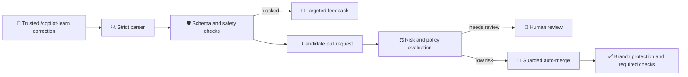

# 🧭 Self-correcting Copilot instructions

Build a secure, auditable pipeline that turns explicit maintainer corrections into repository instruction pull requests, then safely enables low-risk auto-merge. This exercise automates **repository instructions**; it does not train Copilot or make Copilot self-learning.

## 📋 About this exercise

| | |
|---|---|
| 👥 **Audience** | Developers and maintainers comfortable with GitHub Actions and JavaScript |
| 🎯 **Goal** | Implement candidate validation, rule lifecycle, risk policy, and guarded auto-merge |
| ⏱️ **Duration** | 45–60 minutes across two lessons |
| ✅ **Prerequisites** | A GitHub account, Actions enabled, pull request permissions, and Node.js 20 for local validation |

The instruction file has a maintainer-controlled section that automation cannot edit and a bounded learned-rules section managed through pull requests. Every rule has a stable ID, category, state, provenance, and fingerprint.

## ⚙️ Before you start

The local simulation needs only Node.js 20. The live GitHub exercise also needs a few repository settings so its workflows can open candidate pull requests and, in Lesson 2, queue safe pull requests for auto-merge.

### 🔑 Required for Lesson 1

1. Open your repository on GitHub.
2. Select **Settings** > **Actions** > **General**.
3. Under **Workflow permissions**, select **Read and write permissions**.
4. Select **Allow GitHub Actions to create and approve pull requests**.
5. Select **Save**.

These settings let the exercise create a reviewable instruction candidate branch and pull request. The workflow never pushes directly to the default branch.

### 🤖 Required for Lesson 2

**1. Allow auto-merge**

1. Select **Settings** > **General**.
2. Under **Pull Requests**, select **Allow auto-merge**.

**2. Require the evaluator check**

GitHub offers two ways to protect a branch. Use whichever your repository shows.

<details>
<summary><b>Rulesets</b> (Settings > Rules > Rulesets — newer experience)</summary>

1. Select **New ruleset** > **New branch ruleset**, or edit an existing one.
2. Enter a **Ruleset Name**, such as `Instruction candidates`.
3. Set **Enforcement status** to **Active**. A ruleset left as **Disabled** is never applied.
4. Under **Target branches**, select **Add target** > **Include default branch**. Without a target, GitHub warns that the ruleset does not target any resources.
5. Leave **Bypass list** empty so no actor can skip these rules.
6. Select **Require status checks to pass**.
7. Select **Add checks**, then search for and add **Evaluate instruction candidate**.
8. Select **Create** or **Save changes**.

> [!TIP]
> Both banners in a new ruleset are expected until you finish: **This ruleset does not target any resources** clears after step 4, and the **Disabled** badge clears after step 3.

</details>

<details>
<summary><b>Classic branch protection</b> (Settings > Branches)</summary>

1. Select **Add branch protection rule**, or edit the rule for your default branch.
2. Select **Require status checks to pass before merging**.
3. Search for and add **Evaluate instruction candidate**.
4. Select **Create** or **Save changes**.

</details>

> [!NOTE]
> Seeing **No checks have been added** or an empty search? A check only becomes selectable after it has run once. Complete Lesson 1 so **Evaluate instruction candidate** runs on your first candidate pull request, then return here before Step 9.

> [!IMPORTANT]
> Auto-merge does not bypass these rules. It only queues a qualifying low-risk pull request and waits for every required review and check.

## 🚀 Start the exercise

[](../../actions/workflows/0-step.yml)

1. Create a repository from this template or fork it.
2. Complete the **Required for Lesson 1** settings above.
3. Select **Start the exercise**, then select **Run workflow**.
4. Open the issue created by Step 0.
5. Follow the numbered instructions in that issue. Each successful check posts the next step; each failed check posts recovery guidance.

### 💻 Local-only option

To explore the deterministic parser and safety checks without changing GitHub settings:

```bash
npm ci
npm test
npm run validate
npm run simulate
```

No model API, external service, or secret is required.

## 🔁 How the pipeline works



## 🗺️ Lessons

| Lesson | Steps | What you build |
|---|---:|---|
| 🧱 **1 · Governed corrections** | 1–7 | Parse, validate, review, merge, supersede, and revoke instruction candidates |
| 🤖 **2 · Guarded automation** | 8–10 | Classify deterministic low risk, enable native auto-merge, and prove unsafe inputs stay blocked |

## 🔄 Reset or retry

Re-run a failed step workflow after applying its feedback. To restart the exercise, close the exercise issue, revert learner changes, and manually run **Step 0** again. Candidate branches and audit entries are append-only history; revoke or supersede rules instead of deleting that history.

> [!IMPORTANT]
> Auto-merge uses GitHub's native auto-merge capability. It waits for branch protection and required checks and never pushes to the default branch or bypasses protections.
